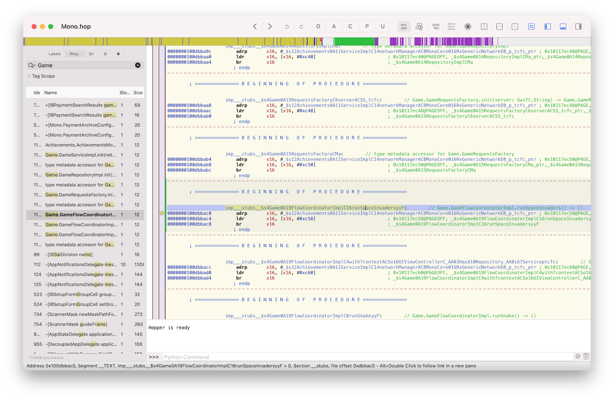

Recently I've done a talk about debugging 3rd party apps on both platforms: iOS and Android, also made a step-by-step demo. After the talk, I decided to write a blog post about the same topic, so here it is. This part will focus on iOS, and in the next one, I will continue with Android.

For the demo purposes, I choose a popular, in Ukraine 🇺🇦, banking app - Monobank. Mainly because they have apps for both platforms - iOS and Android, the apps are mostly native, written using Swift on iOS and Kotlin on Android, and the UI is pretty much the same on both platforms. Also, this app has hidden easter eggs - small games, one of which - Space Invaders I've selected as a target for my demo, and decided to beat the high score using a debugger. So let's start with iOS.

## Prerequisites

### Jailbreak

To debug any 3rd party app or event Apple's own apps or system daemons, we need to have a jailbroken (rooted) iOS device. I recommend to get and jailbreak a dedicated device for these purposes. You can check where ever you are able to jailbreak using this site - [Can I Jailbreak?](https://canijailbreak.com). Because of a recent bootrom level bug found by [@axi0mX](https://twitter.com/axi0mX/status/1177542201670168576) it is possible to jailbreak A7 - A10 devices (iPhone 5s - iPhone X) even on future iOS versions using [checkra1n](https://checkra.in) tool. In my demo, I've used exactly this tool to jailbreak iPhone 7 plus running iOS 14.2 (latest on that time). One other benefit of using checkra1n, you will have `Dropbear SSH` running on port `44`. Apple's default `root` password on iOS is `alpine`. So to login into a device over `SSH` use `root:alpine` as credentials.

### `iproxy`

By now, you should be able to login into a device over Wi-Fi, but I recommend installing one more tool on your Mac to be able to debug over USB, as it's much more reliable and has less latency. The tool is called `iproxy`, it's a part of [usbmuxd](https://github.com/libimobiledevice/usbmuxd) project, and can be installed using: `brew install usbmuxd`. You can use it like this: `iproxy 2222 44`, and what this tool does it basically forwards your device remote port `44` (of `Dropbear SSH`) to your Mac's local port `2222`.

```sh
mbp:~ iproxy 2222 44
Creating listening port 2222 for device port 44
waiting for connection
```

*Note, terminal prompt on my Mac is prefixed by `mbp:~`, on the device - by `iphone-7p:~`. LLDB is running on Mac and is prefixed by `(lldb)`*

You should run that command in a separate terminal and keep it active while you are debugging. After that is done, you can connect to your device from your Mac as if as you are connecting to localhost but just using a forwarded port.

```sh
mbp:~ ssh root@127.0.0.1 -p 2222
```

*Note, I've added my public SSH key (`~/.ssh/id_rsa.pub` on Mac) to `~/.ssh/authorized_keys` on a device, so it doesn't prompt to for a password every time. Recommend you to so as well.*

### Transfer files

To copy files back and forth between Mac and a device, I'm using `scp`. You can also use `rsync` or pretty much anything that allows you to copy files over SSH.

Copy to device:

```sh
mbp:~ scp -P 2222 $FILE_PATH_ON_MAC $FILE_PATH_ON_DEVICE
```

Copy form device:

```sh
mbp:~ scp -P 2222 $FILE_PATH_ON_DEVICE $FILE_PATH_ON_MAC
```

## Static analysis

### Apple FairPlay DRM

Before we begin debugging, I want to perform some basic static analysis of a binary. To do so first, we need to decrypt a binary of any 3rd party app that we copy over `scp` for further analysis. That's because every app you install from the AppStore is encrypted using Apple FairPlay DRM and tight to your Apple ID account. To decrypt apps I prefer using a tool called [dumpdecrypted](https://github.com/stefanesser/dumpdecrypted) by [@i0n1c](https://twitter.com/i0n1c). It's really simple to use and doesn't require any other dependencies. We need to compile and sign it using A valid dev certificate or fake sign it on the device itself using [ldid](http://iphonedevwiki.net/index.php/Ldid) tool (preferred method).
To sign binary on a device using `ldid` run it as follows:

```sh
iphone-7p:~ ldid -S dumpdecrypted.dylib
```

Now we can decrypt an app. To do so, we will inject `dumpdecrypted.dylib` into an app's process, and the lib will do the rest. To inject a dynamic library in the process on macOS and iOS we can use `DYLD_INSERT_LIBRARIES` environmental variable. `DYLD_INSERT_LIBRARIES` is Apple's analog of Linux `LD_PRELOAD` or Windows `AppInit_DLLs` mechanism.

```sh
iphone-7p:~ DYLD_INSERT_LIBRARIES=/path/to/dumpdecrypted.dylib /var/containers/Bundle/Application/$APP_UUID/$APP_NAME.app/$APP_BIN`
```

In my case the command looks like this:

```sh
iphone-7p:~ DYLD_INSERT_LIBRARIES=/var/root/tools/dumpdecrypted.dylib /var/containers/Bundle/Application/7E18AC4D-F4C1-4AC8-B35B-8EE30BA9851E/Mono.app/Mono
```

And produces output similar to this:

```sh
...
mach-o decryption dumper

DISCLAIMER: This tool is only meant for security research purposes, not for application crackers.

[+] detected 64bit ARM binary in memory.
[+] offset to cryptid found: @0x1044fd108(from 0x1044fc000) = 1108
[+] Found encrypted data at address 0009f000 of length 4096 bytes - type 1.
[+] Opening /private/var/containers/Bundle/Application/7E18AC4D-F4C1-4AC8-B35B-8EE30BA9851E/Mono.app/Mono for reading.
[+] Reading header
[+] Detecting header type
[+] Executable is a plain MACH-O image
[+] Opening Mono.decrypted for writing.
[+] Copying the not encrypted start of the file
[+] Dumping the decrypted data into the file
[+] Copying the not encrypted remainder of the file
[+] Setting the LC_ENCRYPTION_INFO->cryptid to 0 at offset 1108
[+] Closing original file
[+] Closing dump file
```

Decrypted binary will be dumped into a current working directory:

```sh
iphone-7p:~ file Mono.decrypted
Mono.decrypted: Mach-O 64-bit arm64 executable
```

We can copy it from the device and load it into a disassembler for analysis.

Note, that all the AppStore apps are located under `/var/containers/Bundle/Application/` + random app UUID. There no way (that I know of) to figure out this UUID, so I just list all of them to find the desired app by simply using `find` and reviewing the ouput:

```sh
iphone-7p:~ find /var/containers/Bundle/Application/* -name *.app
/var/containers/Bundle/Application/09B9A73F-BCB0-4061-B107-914A4E6F320F/AppleTV.app
/var/containers/Bundle/Application/0AFD02C4-2AC6-4550-840E-0DFA4A779F5A/Home.app
/var/containers/Bundle/Application/0DB7F077-64ED-4FC9-B591-EAF4E2D775A8/MobileCal.app
...
```

And the main binary inside an app bundle is usually named the same as the app bundle.

You can also make a tarball of the app bundle and copy it into your Mac for further analysis:

```sh
iphone-7p:~ tar -czvf app.tar.gz -C /var/containers/Bundle/Application/$UUID .
```

Copy `app.tar.gz` into your home directory on Mac:

```sh
mbp:~ scp -P 2222 root@localhost:~/app.tar.gz ~/
```

### Disassembler

In this tutorial, I will use [Hopper Disassembler](https://www.hopperapp.com). I prefer Hopper for simple tasks as it is pretty quick and runs natively on Mac, it costs $99, a trial version works only for 30 mins per session, but you can use other free and open-source disassemblers such as [Ghidra](https://ghidra-sre.org) or command line [Radare2](https://rada.re/n/). For our basic tasks, it doesn't really matter.

When I'm writing this, the latest version of Monobank app for iOS is `1.33.1`, I will be using it, so something may be different in the newer versions. Let's import our **decrypted** binary into Hopper and try to find some interesting references. I searched for "Game".

*Note that initial analysis of the binary can take time.*



Here we found interesting method named  `imp___stubs__$s4Game0A19FlowCoordinatorImplC16runSpaceInvadersyyF`, Hopper [demangles](https://en.wikipedia.org/wiki/Name_mangling) this name to what looks like Swift method with next signature `Game.GameFlowCoordinatorImpl.runSpaceInvaders() -> ()`. From the method name alone, prefixed with `imp___stubs__` we can conclude the this method's implementation doesn't exist in our main binary but is loaded by [dyld](https://mikeash.com/pyblog/friday-qa-2012-11-09-dyld-dynamic-linking-on-os-x.html) from an external dynamic library and is resolved at runtime. So to continue our investigation, we should look for `Game` framework, which sits alongside our main binary inside `Frameworks` subdirectory in our app bundle. (If the default Xcode project settings were not changed during development.)

But before we continue further with our main goal of achieving the highest score, let's play with a debugger a little bit.

### Debugger

We will debug our binary using LLDB debugger. LLDB can be used in two modes. As a standalone debugger, you just run an app under a debugger like this `lldb $PATH_TO_BIN`. Or it can be used in client-server style (the way Xcode uses it), where you deploy server component to your target machine (an iOS device in our case) and connect to it from a client part (our Mac). We will use a second method.

First, we need to copy arm64 LLDB backend to our device, it can be found alongside Xcode distribution here `/Applications/Xcode.app/Contents/Developer/Platforms/iPhoneOS.platform/DeviceSupport/$VER/DeveloperDiskImage.dmg` under `/usr/bin/debugserver`. After copying it to the device, we also need to re-sign it using this [entitlements](https://gist.github.com/danylokos/a9c203648be8d3212639d25b5ddd95e6) and `ldid` like this `ldid -Sent.xml debugserver`. You can learn more about it at [iPhoneDevWiki: debugserver](https://iphonedevwiki.net/index.php/Debugserver)

To debug the app, let's first also froward a port on which our debugger will listen for a client connection using `iproxy`.

```sh
mbp:~ iproxy 1111 1111
Creating listening port 1111 for device port 1111
waiting for connection
```

To fire up the debug server on the device use the following command:

```sh
iphone-7p:~ debugserver localhost:1111 -x backboard /var/containers/Bundle/Application/$APP_UUID/$APP_NAME.app/$APP_BIN`
debugserver-@(#)PROGRAM:LLDB  PROJECT:lldb-1200.2.12
 for arm64.
Listening to port 1111 for a connection from localhost...
```

Notice that `-x backboard`, this is necessary when you are debugging a GUI-enabled (basically any 3rd party) app, without it the app might not show up on the screen.

Now we are ready to connect to `debugserver` form the Mac, simply launch `lldb`:

```sh
mbp:~ lldb
```

Type in `platform select remote-ios` into LLDB command prompt to select our remote target.

```
(lldb) platform select remote-ios
  Platform: remote-ios
 Connected: no
  SDK Path: "/Users/danylokos/Library/Developer/Xcode/iOS DeviceSupport/14.2 (18B92)"
 SDK Roots: [ 0] "/Users/danylokos/Library/Developer/Xcode/iOS DeviceSupport/14.2 (18B92)"
```

And actually connect to it:

```
 (lldb) process connect connect://localhost:1111
Process 2001 stopped
* thread #1, stop reason = signal SIGSTOP
    frame #0: 0x0000000104919000 cy-4jQS45.dylib`_dyld_start
cy-4jQS45.dylib`_dyld_start:
->  0x104919000 <+0>:  mov    x28, sp
    0x104919004 <+4>:  and    sp, x28, #0xfffffffffffffff0
    0x104919008 <+8>:  mov    x0, #0x0
    0x10491900c <+12>: mov    x1, #0x0
Target 0: (Mono) stopped.
(lldb)
```

All of the above processes are actually very well described by [@kov4l3nko](https://twitter.com/kov4l3nko) in his [blog post series](https://kov4l3nko.github.io/blog/2016-04-27-debugging-ios-binaries-with-lldb/#using-lldbinit). I encourage you to check it out.

### ASLR

One more thing to mention when working with addresses in a debugger is [ASLR](https://blog.morphisec.com/aslr-what-it-is-and-what-it-isnt/). It's a security feature that should protect the app running on the end-users' devices to be easily exploitable in case of memory corruption-related bugs. The OS randomize the base loading address of the binary each time it's started. Just keep this in mind for now.

So let's get back to our app of interest.

## Debugging

Let's find the place where our game starts and try to launch it from the debugger!

Let's follow the reference to `imp___stubs__$s4Game0A19FlowCoordinatorImplC16runSpaceInvadersyyF` which we found previously in Hopper. To do that in Hopper press <kbd>X</kbd> while the cursor is standing on the address of the first instruction of the method (`0x100dbbac0`) or its name.


Follow the reference, and you will end up in the middle of the other method.


You can always try to figure out what is an execution flow and how you can get to that specific code path by reading assembly instructions and following the references all the way up. It's also might be helpful to use a graph view.


But let's do this using LLDB. Here is a [LLDB command map](http://lldb.llvm.org/use/map.html) (and their GDB counterparts).

Launch the app under LLDB. It will stop the execution at a very early point - `_dyld_start` it's when the `dyld` start doing its work - resolving all external dependencies. Continue execution of the program, type `continue` or `c` into LLDB command prompt. Wait until it finishes launching the app. Now let's set a breakpoint at the address that we found earlier - `0x10083ab68`, when the app calls a method from an external `Game` library. To do that, first we need to know the  base address of our main binary,. You can find it by using `image list` command in LLDB.

```
(lldb) im li Mono
[  0] 6C0FF178-B8CF-351A-A018-5D46A1727353 0x0000000102850000 /private/var/containers/Bundle/Application/7E18AC4D-F4C1-4AC8-B35B-8EE30BA9851E/Mono.app/Mono (0x0000000102850000)
(lldb)
```

Where `Mono` is the name of our main binary. Here it's `0x102850000`. Now we need to apply ALSR slide to address we found in a disassembler previously (`0x10083ab68`). All the standalone executables you load into a disassembler by default are loaded with the base address, for arm64 iOS binary it's `0x100000000`. So to calculate a real address in a currently running process we need to do next: `0x10083ab68` (value from disassembler) - `0x100000000` (base load address) + `0x102850000` (base address found in LLDB). Or simply drop `0x1` at the beginning of the disassembler value and add the base address from LLDB: `0x83ab68` + `0x102850000`. Now set a breakpoint at that address in LLDB:

```
(lldb) br set -a 0x102850000+0x83ab68
Breakpoint 2: where = Mono`___lldb_unnamed_symbol81697$$Mono + 1152, address = 0x000000010308ab68
```

To verify that this is exaact function we need we can look into disassebmled code at address (first 5 instructions) using coomand `disassemble`:

```
(lldb) dis -s 0x102850000+0x83ab68 -c 5
Mono`___lldb_unnamed_symbol81697$$Mono:
    0x10308ab68 <+1152>: bl     0x10360bac0               ; symbol stub for: Game.GameFlowCoordinatorImpl.runSpaceInvaders() -> ()
    0x10308ab6c <+1156>: adrp   x1, 3389
    0x10308ab70 <+1160>: add    x1, x1, #0xb40            ; =0xb40
    0x10308ab74 <+1164>: adrp   x2, 3285
    0x10308ab78 <+1168>: add    x2, x2, #0xeb8            ; =0xeb8
(lldb)
```

As you can see those are the exact instructions we can see in Hopper.


Let's test our breakpoint and launch the game manually on the phone. To do so make a pull to refresh gesture on the main screen and try to tap on the rocket while it's moving. The game should launch, and a breakpoint will fire:

```
Process 2134 stopped
* thread #1, queue = 'com.apple.main-thread', stop reason = breakpoint 2.1
    frame #0: 0x000000010308ab68 Mono`___lldb_unnamed_symbol81697$$Mono + 1152
Mono`___lldb_unnamed_symbol81697$$Mono:
->  0x10308ab68 <+1152>: bl     0x10360bac0               ; symbol stub for: Game.GameFlowCoordinatorImpl.runSpaceInvaders() -> ()
    0x10308ab6c <+1156>: adrp   x1, 3389
    0x10308ab70 <+1160>: add    x1, x1, #0xb40            ; =0xb40
    0x10308ab74 <+1164>: adrp   x2, 3285
Target 0: (Mono) stopped.
```

Now you can view the backtrace of all the calls that leads to the game launch using `bt` command:

```
(lldb) bt
* thread #1, queue = 'com.apple.main-thread', stop reason = breakpoint 2.1
  * frame #0: 0x000000010308ab68 Mono`___lldb_unnamed_symbol81697$$Mono + 1152
    frame #1: 0x000000010308ad44 Mono`___lldb_unnamed_symbol81698$$Mono + 28
    frame #2: 0x00000001acda727c UIKitCore`-[UIApplication sendAction:to:from:forEvent:] + 96
    frame #3: 0x00000001ac73c254 UIKitCore`-[UIControl sendAction:to:forEvent:] + 240
    frame #4: 0x00000001ac73c598 UIKitCore`-[UIControl _sendActionsForEvents:withEvent:] + 352
    frame #5: 0x00000001ac73aed0 UIKitCore`-[UIControl touchesEnded:withEvent:] + 532
    frame #6: 0x00000001acde1f8c UIKitCore`-[UIWindow _sendTouchesForEvent:] + 1244
    frame #7: 0x00000001acde38b4 UIKitCore`-[UIWindow sendEvent:] + 3824
    frame #8: 0x00000001acdbee50 UIKitCore`-[UIApplication sendEvent:] + 744
    frame #9: 0x00000001ace4145c UIKitCore`__dispatchPreprocessedEventFromEventQueue + 1032
    frame #10: 0x00000001ace45bfc UIKitCore`__processEventQueue + 6440
    frame #11: 0x00000001ace3cee0 UIKitCore`__eventFetcherSourceCallback + 156
    frame #12: 0x00000001aa4bdbe0 CoreFoundation`__CFRUNLOOP_IS_CALLING_OUT_TO_A_SOURCE0_PERFORM_FUNCTION__ + 24
    frame #13: 0x00000001aa4bdae0 CoreFoundation`__CFRunLoopDoSource0 + 204
    frame #14: 0x00000001aa4bce28 CoreFoundation`__CFRunLoopDoSources0 + 256
    frame #15: 0x00000001aa4b73d0 CoreFoundation`__CFRunLoopRun + 776
    frame #16: 0x00000001aa4b6b90 CoreFoundation`CFRunLoopRunSpecific + 572
    frame #17: 0x00000001c07d9598 GraphicsServices`GSEventRunModal + 160
    frame #18: 0x00000001acda0638 UIKitCore`-[UIApplication _run] + 1052
    frame #19: 0x00000001acda5bb8 UIKitCore`UIApplicationMain + 164
    frame #20: 0x00000001028ef5fc Mono`___lldb_unnamed_symbol4168$$Mono + 56
    frame #21: 0x00000001aa195588 libdyld.dylib`start + 4
(lldb)
```

Let's ignore all the default frameworks calls such as `CoreFoundation` or `UIKitCore` and focus on the two at the top that are actually part of our binary `0x10308ad44` and `0x10308ab68`. To find the relative address without the ASLR slide we can calculate it manually or use `image lookup`:

```
(lldb) im loo -a 0x10308ad44
      Address: Mono[0x000000010083ad44] (Mono.__TEXT.__text + 8608004)
      Summary: Mono`___lldb_unnamed_symbol81698$$Mono + 28
(lldb)
```

And `0x10083ad44` is the address that we can jump to in Hopper using <kbd>G</kbd>.


Here we can see something that looks like Objective-C method name `-[_TtC4Mono18HomeViewController didTapPTR]`, it's mangled because of framework prefix in use. And translates to `-[Mono.HomeViewController didTapPTR]` let's try to call it from the debugger! It's an instance method so we should have some reference to the `Mono.HomeViewController` object itself.
By default, LLDB doesn't support searching for instances of the particular class. That's basically can't even be LLDB feature because it relies heavily on the runtime, and thankfully Objective-C runtime support this kind of trickery. To add this ability into LLDB, you can load this [collection of LLDB scipts](https://github.com/DerekSelander/LLDB) by  [@LOLgrep](https://twitter.com/LOLgrep) author of (Advanced Apple Debugging & Reverse Engineering)[https://www.raywenderlich.com/books/advanced-apple-debugging-reverse-engineering/v3.0]. After you load the scripts, you can use `search` command:

```
(lldb) search Mono.HomeViewController
<Mono.HomeViewController: 0x10b9ef800>
```

Now to call `didTapPTR` use `expression` command of LLDB. But before doing that you will need to stop the exectution of the programm by pressing <kbd>Ctrl</kbd> + <kbd>B</kbd>, and resuming after with `(lldb) c`.

```
(lldb) expr (void)[0x10b9ef800 didTapPTR]
(lldb) c
```

Hooray! We have our game launched without even interacting with the phone!

That was a small intro into LLDB, now let's get back to beating the high score.

As we figured out before - game-related code is stored inside `Game` framework and is resolved at runtime. We can quickly find it inside the app bundle at `Frameworks/Game.framework/Game`. Let's disassemble it. And start looking for something interesting related to the score.


I end up setting breakpoints on everything related to the score and debugging it, and eventually fond the next two methods:

-  `_$s4Game0A14RepositoryImplC11updateScore_3forySi_AA0A4TypeOtF` at `0x11684`, which Hopper demangles as `Game.GameRepositoryImpl.updateScore(_: Swift.Int, for: Game.GameType) -> ()`

- `_$s4Game0A11ServiceImplC8setScore_11sessionTime5bonus6gameId0I07RxSwift10ObservableCyAA0aE8ResponceVSgGSi_S2iSSAA0A4TypeOtF` at `0x17040`, demangles as `Game.GameServiceImpl.setScore(_: Swift.Int, sessionTime: Swift.Int, bonus: Swift.Int, gameId: Swift.String, game: Game.GameType) -> RxSwift.Observable<Game.GameScoreResponce?>`

*Note that because it's a dynamic library and not a standalone executable, Hopper doesn't apply base offset to it (by default), so all the address are actually absolute to the beginning of the binary, and there is no need to subtract `0x100000000` while calculating address in LLDB.*

Now let's once again find this image (binary) loading address:

```
(lldb) im li Game
[  0] CE186AF8-AD5E-33F2-8F0F-EB5052F6D2D0 0x00000001075b0000 /private/var/containers/Bundle/Application/7E18AC4D-F4C1-4AC8-B35B-8EE30BA9851E/Mono.app/Frameworks/Game.framework/Game (0x00000001075b0000)
(lldb)
```

It's 0x1075b0000, so now can set both breakpoints:

```
(lldb) br set -a 0x00000001075b0000+0x11684
Breakpoint 1: where = Game`___lldb_unnamed_symbol372$$Game, address = 0x00000001075c1684
(lldb) br set -a 0x00000001075b0000+0x17040
Breakpoint 2: where = Game`___lldb_unnamed_symbol533$$Game, address = 0x00000001075c7040
(lldb)
```

And try to play the game and lose after scoring 3 for example. The second breakpoint `0x17040` got hit, but not the first one `0x11684`.

```
Process 2166 stopped
* thread #1, queue = 'com.apple.main-thread', stop reason = breakpoint 2.1
    frame #0: 0x00000001075c7040 Game` ___lldb_unnamed_symbol533$$Game
Game`___lldb_unnamed_symbol533$$Game:
->  0x1075c7040 <+0>:  sub    sp, sp, #0xe0             ; =0xe0
    0x1075c7044 <+4>:  stp    x28, x27, [sp, #0x80]
    0x1075c7048 <+8>:  stp    x26, x25, [sp, #0x90]
    0x1075c704c <+12>: stp    x24, x23, [sp, #0xa0]
    0x1075c7050 <+16>: stp    x22, x21, [sp, #0xb0]
    0x1075c7054 <+20>: stp    x20, x19, [sp, #0xc0]
    0x1075c7058 <+24>: stp    x29, x30, [sp, #0xd0]
    0x1075c705c <+28>: add    x29, sp, #0xd0            ; =0xd0
Target 0: (Mono) stopped.
(lldb)
```

Maybe that's because we only score 5, and the first one is actually updating the high score, which we did not beat in this case?

Let's try again, score 5 in the game and break on `0x17040` (not need to edit breakpoints). This time we will edit some values. The function, in which we stopped the execution right now, according to it signature `Game.GameServiceImpl.setScore(_: Swift.Int, sessionTime: Swift.Int, bonus: Swift.Int, gameId: Swift.String, game: Game.GameType) -> RxSwift.Observable<Game.GameScoreResponce?>` should take atleast 5 parameters `score`, `sessionTime`, `bonus`, `gameId` and `game` and by arm64 calling convention first 8 parametrs to a function are passed through the **registers**. Here is a [arm64 assembly crash course](https://github.com/Siguza/ios-resources/blob/master/bits/arm64.md) by [@s1guza](https://twitter.com/s1guza) where you can read more about it. To read registers in LLDB use `reg read`:

```
(lldb) reg read
General Purpose Registers:
        x0 = 0x0000000000000005
        x1 = 0x0000000000002b2b
        x2 = 0x0000000000000000
        x3 = 0xc000000000000014
        x4 = 0x4000000281756940
        x5 = 0x0000000000000000
...
```

As you can see the first - `x0` register is equal to 5 - our score! Let's change it with `reg write`:

```
(lldb) reg write x0 125
```

Confirm that register values was changes:

```
(lldb) reg r x0
      x0 = 0x000000000000007d
```

As you can see it's equal hex `0x7d` which is 125 in decimal.

Continue execution. The first breakpoint at `0x11684` got hit:

```
Process 2166 stopped
* thread #1, queue = 'org.reactivecocoa.ReactiveObjC.RACScheduler.mainThreadScheduler', stop reason = breakpoint 1.1
    frame #0: 0x00000001075c1684 Game` ___lldb_unnamed_symbol372$$Game
Game`___lldb_unnamed_symbol372$$Game:
->  0x1075c1684 <+0>:  stp    x26, x25, [sp, #-0x50]!
    0x1075c1688 <+4>:  stp    x24, x23, [sp, #0x10]
    0x1075c168c <+8>:  stp    x22, x21, [sp, #0x20]
    0x1075c1690 <+12>: stp    x20, x19, [sp, #0x30]
    0x1075c1694 <+16>: stp    x29, x30, [sp, #0x40]
    0x1075c1698 <+20>: add    x29, sp, #0x40            ; =0x40
    0x1075c169c <+24>: sub    sp, sp, #0x1e0            ; =0x1e0
    0x1075c16a0 <+28>: mov    x19, x0
Target 0: (Mono) stopped.
```

You can see that this function is also called with our new high score value of 125:

```
(lldb) reg r x0
      x0 = 0x000000000000007d
```

Continue execution once more. Now exit and run the game again. You should see the updated hight score in the game :)


### Code injection

There is other fun stuff that you can do with a debugger like code injection.

Do you have any favorite debugging libraries that you use in your projects? I have mine, it's [FLEX](https://github.com/FLEXTool/FLEX). When injected, it allows to manipulate UI elements on the screen, move them around, read app keychain storage (as you are running inside app process basically), read UserDefaults, view network traffic and many many more, all in one library!

You can build it yourself, copy it to a device and re-sign. After that, you will need to inject it into a process and call the only singleton method the library exposes, and that's all.

```
(lldb) process load /var/root/tools/libFLEX.dylib
Loading "/var/root/tools/libFLEX.dylib"...ok
Image 0 loaded.
(lldb) expr (void)[[FLEXManager sharedManager] showExplorer]
(lldb) c
Process 2166 resuming
(lldb)
```


Same way you can actually inject other libraries that can hook networking stack and disable SSL pinning to be able to perform MITM attack with your own proxy server running locally on your Mac and view all the traffic, but that's another story :)

That's it for the iOS part. See you in the second part of this article about Android.

## Links

- [Debugging iOS binaries with LLDB - @kov4l3nko](https://kov4l3nko.github.io/blog/2016-04-27-debugging-ios-binaries-with-lldb/)
- [Debugging Swift code with LLDB  by Ahmed Sulaiman](https://medium.com/flawless-app-stories/debugging-swift-code-with-lldb-b30c5cf2fd49)
- [LLDB command map](http://lldb.llvm.org/use/map.html)
- [GitHub - DerekSelander/LLDB: A collection of LLDB aliases/regexes and Python scripts to aid in your debugging sessions](https://github.com/DerekSelander/LLDB)
- [arm64 assembly crash course by @Siguza](https://github.com/Siguza/ios-resources/blob/master/bits/arm64.md)
- [ARMv8 A64 Quick Reference](https://courses.cs.washington.edu/courses/cse469/18wi/Materials/arm64.pdf)
- [Writing ARM64 Code for Apple Platforms](https://developer.apple.com/documentation/xcode/writing_arm64_code_for_apple_platforms?language=objc)
- [GitHub - FLEXTool/FLEX: An in-app debugging and exploration tool for iOS](https://github.com/FLEXTool/FLEX)
- [GitHub - nabla-c0d3/ssl-kill-switch2: Blackbox tool to disable SSL certificate validation - including certificate pinning - within iOS and OS X Apps](https://github.com/nabla-c0d3/ssl-kill-switch2)

---

Thanks fo reading, you can ping me on Twitter [@danylo_kos](https://twitter.com/danylo_kos) if you have any questions.