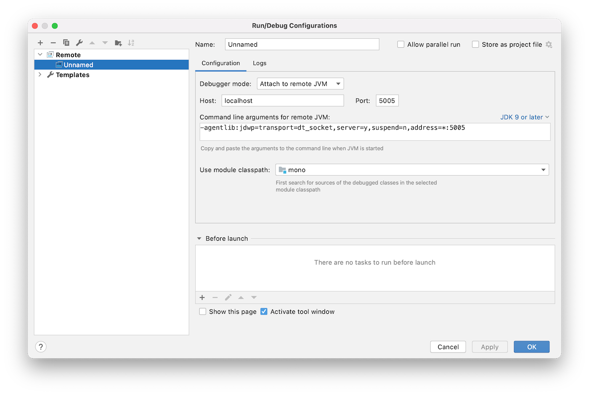

This is the second part of my step-by-step tutorial on debugging 3rd party apps. In this part, I will focus on Android. The first part, on iOS, can be found [here]({{ site.baseurl }}/0x01/).

## Prerequisites

### To `root` or not to `root`? - `root`!

On Android, unlike iOS, it's possible to debug apps from the Google Play Store even without the `root` access. But it requires a lot of overhead:

1. pull the `apk` from the device
1. unpack and decode the `apk`
1. set `android:debuggable="true"` in `AndroidManifest.xml`
1. re-pack the `apk`
1. re-sign with temporary key store
1. remove an old app from the device
1. install modified `apk`

As you can see, there are a lot of steps, and that's just for a single app. In the case of the new update for the app available, it will be necessary to do it all over again. So I decided to just simply `root` the device and skip all those steps altogether. With `root`, you can set `ro.debuggable 1` flag globally in a prop file, this will make all the apps debuggable by default.

Start ADB shell:

```sh
mbp:~ adb shell
```

Become root:

```
walleye:/ $ su
```

Edit prop file using Magisk:

```
walleye:/ # magisk resetprop ro.debuggable 1
```

Re-start Android zygote process:

```
walleye:/ # stop; start;
```

*Note, terminal prompt on my Mac is prefixed by `mbp:~`, on the device - by `walleye:/ $`. GDB is running on Mac and is prefixed by `(gdb)`*

In this tutorial, I'm using Google Pixel 2 running Android 11. I used A custom boot image [TWRP](https://twrp.me) and `root`-ed it using [Magisk](https://github.com/topjohnwu/Magisk/releases/). The process might be very different for different devices so I will not describe it here.

There are mainly two types of apps you might want to debug on Android:

- system daemons or other native binaries
- apps that are running on top of [ART or Dalvik](https://source.android.com/devices/tech/dalvik), typically installed from Google Play Store

### Native binaries

If you need to debug a native binary, this can be done using GDB. I will not describe this process in much detail because it's actually very similar to one on iOS using LLDB. And this post is more about apps from the store.

To debug native binary, first, we need to find `gbdserver` on your Mac at `$ANDROID_SDK/ndk/$VER/prebuilt/android-$ARCH/gdbserver/gdbserver` and put it somewhere on the device using `adb push`.

```sh
mbp:~ adb push gdbserver /data/local/tmp/
test: 1 file pushed, 0 skipped.
```

Than find `gdb` frontend at `$ANDROID_SDK/ndk/$VER/prebuilt/darwin-x86_64/bin/gdb`, we will use it to connect to the `gbdserver`. 

Run `gdbserver` on the device:

```sh
walleye:/ $ gdbserver localhost:1111 --attach $PID
```

To find `$PID` you are interested in simply use `ps`

```sh
walleye:/ $ ps -A | grep youtube
u0_a168       32360    888 16589384 178608 0                  0 S com.google.android.youtube
```

Here Youtube's `$PID` is `32360`.

Now, forward device port on which `gdbserver` is running to your Mac by using `adb forward`:

```sh
mbp:~ adb forward tcp:1111 tcp:1111
```

Run `gdb` on and connect to the remote `gdbserver` running on the device:

```sh
mbp:~ gdb
(gdb) target remote localhost:1111
```

After that is done, you can now set breakpoints, watch/edit registers, read/write memory, do whatever you need to. Here is [LLDB/GDB command map](http://lldb.llvm.org/use/map.html) which can help you.

You can find more on how to debug native binaries in this awesome blog post series - [Debugging third-party machine code in Android](https://kov4l3nko.github.io/blog/2018-01-16-debugging-machine-code-android/) by [@kov4l3nko](https://twitter.com/kov4l3nko).

### ART/Dalvik

For the purposes of this demo, I use the same app I used in iOS part of this tutorial - Monobank, version `1.33.5`. And once again, we will try to beat the high score at Space Invaders - a built-in easter egg game.

## Static analysis

Let's begin with static analysis. To know exactly what we need to debug, it's a good idea to gather at least some information about the code first.

First, we need to pull apk from the device:

```sh
mbp:~ adb shell pm list packages
mbp:~ adb shell pm path com.example.someapp
mbp:~ adb pull /data/app/.../base.apk
```

### Unpack APK

I'm using [Apktool](https://ibotpeaches.github.io/Apktool/), it's very well maintained and up-to-date. It supports different packing algorithms, like newer [AAPT2](https://developer.android.com/studio/command-line/aapt2). If you have trouble unpacking the apk using other tools, try Apktool. Without any additional arguments, Apktool will not only unpack the apk, but will also do the process of `backsmaling` it. This is how you can decode apk using `apktool`:

```sh
mbp:~ apktool d testapp.apk -o testapp/
```

Let's try to find some interesting references. I'm using [`ripgrep`](https://github.com/BurntSushi/ripgrep):

```sh
...
smali_classes7/com/ftband/monogame/c.smali
20:        "score",
386:    const-string p2, "gameApi.sendResult(score\u2026          }\n            }"
...
```

Among others, I found this file `smali_classes7/com/ftband/monogame/c.smali` and reference to `gameApi` and `score` inside it.

### smali/backsmali

In Dalvik (Andoird VM) Smali is the name of the bytecode language used in `dex` files, the process of assembling/disassembling it, is called smali/backsmali.

There is an official documentation on [Dalvik bytecode and calling conventions](https://source.android.com/devices/tech/dalvik/dalvik-bytecode.html), also great short notes by [@JesusFreke](https://github.com/JesusFreke/), author of smali/baksmali utils, about [Types Methods And Fields](https://github.com/JesusFreke/smali/wiki/TypesMethodsAndFields) and [Registers](https://github.com/JesusFreke/smali/wiki/Registers). Highly recommend to take a look.

It's possible to "decompile" smali and get a high-level Java code using tools like [JADX](https://github.com/skylot/jadx) - Dex to Java decompiler, but in my opinion, such tools might not always produce correct Java code. This problem is not unique to dex-to-Java "decompilation", but applies to regular native assembly language-to-C like code as well. And still, if you need to patch the app and re-pack it back, it needs to be done in raw smali byte code, so you should get familiar with it if you want to do something like this.

## Debugging

Basically, you can use any debugger that works with JWDP - Java Debug Wire Protocol. You can even use command line `jdb` - The Java Debugger, but I highly don't recommend it, it's not even remotely close to what LLDB can offer for native binaries.

To debug over JWDP, we will need to do some forward porting once again.

```sh
mbp:~ adb shell ps -A | grep $PACKAGE_ID
mbp:~ adb forward tcp:5005 jdwp:$PID
```

To reset previously forwarded ports use:

```sh
mbp:~ adb forward —-remove-all
```

### IntelliJ IDEA + smalidea

To be able to comfortably read and debug smali code we can use IntelliJ IDEA with [smalidea](https://github.com/JesusFreke/smali/wiki/smalidea) plugin. For some reason, smalidea didn't work for me with Android Studio, so I simply used IntelliJ IDEA.

Just import the directory in which we unpack our apk, and give it some time to index everything.

Install smaliidea plugin, so we can debug the byte code.

Add new remote configuration for debugging. Use the same port - `5005` on Mac to which we already forwarded jdwp port on the device:



Set a breakpoint at function `c.smali:386 const-string ...`, the line we found using `ripgrep`:

```sh
com.ftband.monogame.c.smali:
...
* 386: const-string p2, "gameApi.sendResult(score\u2026          }\n            }"
...
```

And start the debugging. Launch the game on the device. Make a pull-to-refresh gesture and quickly tap on the rocket while it's flying up.

Play the game a little bit, and lose. You will hit a breakpoint.


Analyze a stack trace.

You can see inside `MainPageFragment$initGame$4.smali` a reference like this:


```sh
com.ftband.app.main.MainPageFragment$initGame$4.smali:
...
  130: invoke-virtual {v0, p1, p2, v1, p3}, Lcom/ftband/monogame/GameViewModel;->J5(IILcom/ftband/monogame/GameType;Z)V
...
```

Which calls a method named `J5` of `com.ftband.monogame.GameViewModel` instance and takes 4 arguments: two `integers`, one enum value of type `com.ftband.monogame.GameType`, a `boolean` flag and returns `void`.

Set a breakpoint on this method and run a game once again and score `6` points, after that - lose. You can see one of the register values in a debugger view, and it looks like our score!


Change it to `130` for example, and continue execution.


Now exit the game and run it once again. As you can see, our high score got updated with a new value.

*Note, due to a bug on my device or with smaliidea itself, not sure yet, I'm not able to see and edit any arbitrary local variable or register value inside Debugger View. Instead, I'm getting an `Internal Error` error every time I add a register to a Watch Variables. There are multiple issues about this already, [one of them](https://github.com/JesusFreke/smali/issues/753). That's just luck, that the register value of `p1`, which actually holds the score is visible and editable. I will show you later in this post how we can workaround this issue for now.*

### Frida

[Frida](https://frida.re/docs/home/) is another debugger-like tool that we can use to trace call stack, watch arguments that are getting passed and even hook and modify return values. It's scriptable using JS as it injects QuickJS Javascript Engine into your process. And support all of the main platforms: iOS, macOS, Android, Linux, Windows.

Frida, like other debuggers, consists of two parts `frida-server` - which should be installed on the target device and `frida` client that we use from the Mac.

You can always find the latest Firda releases on [Github](https://github.com/frida/frida/releases/).

Download `firda-server` for `android-arm64`. Push `firda-server` on to device:

```sh
mbp:~ adb push firda-server /data/local/tmp/
test: 1 file pushed, 0 skipped.
```

Start it in the background in a subshell using `&` at the end:

```sh
walleye:/ $ /data/local/tmp/fida-server &
```

Frida client is distributed via PyPi and can be installed using Python's `pip`. I prefer to install it inside a virtual environment.

```sh
mbp:~ virtualenv -p python3 .venv/
...
mbp:~ source .venv/bin/activate
(.venv) mbp:~ pip install frida-tools
```

I will now show here how to use Frida itself here, as it's a complex tool and deserves a separate post. But, I will show you how to use `frida-trace` - a thin wrapper around Frida. We will use it to trace `J5` method from `com.ftband.monogame.GameViewModel` to see what arguments are getting passed. `frida-trace` comes within default distribution, so you already have it installed alongside a main `frida` module.

Let's trace some calls:

```sh
(.venv) mbp:~ frida-trace -U -f com.ftband.mono -j '*monogame*!*/is'`
```

Here, `frida-trace` will generate hooks for all the methods matching our pattern string and after that will launch the app.

Try to launch the game and lose after scoring `2` points:

```sh
 ...
 20167 ms  GameViewModel.D5("<instance: com.ftband.monogame.GameViewModel>", "yE_6M4kWu5XGJMWjlGPO")
 20168 ms  GameViewModel.M5(0, 0)
 22487 ms  GameViewModel.M5(1, 0)
 24131 ms  GameViewModel.M5(1, 0)
 24534 ms  GameViewModel.J5(2, 4718, "<instance: com.ftband.monogame.GameType>", false)
 24535 ms     | c.f(2, 4718, "yE_6M4kWu5XGJMWjlGPO", "<instance: com.ftband.monogame.GameType>", false)
 24536 ms     |    | b.d("<instance: java.lang.Integer>", "<instance: java.lang.Integer>", "yE_6M4kWu5XGJMWjlGPO", "<instance: com.ftband.monogame.GameType>", false)
 24541 ms     |    | <= "<instance: io.reactivex.i0, $className: io.reactivex.internal.operators.observable.l1>"
 24541 ms     | <= "<instance: io.reactivex.i0, $className: io.reactivex.internal.operators.single.SingleFlatMap>"
           /* TID 0x4242 */
 25171 ms  c.b("<instance: com.ftband.monogame.GameType>")
 25172 ms     | b.a("<instance: com.ftband.monogame.GameType>")
 25172 ms     | <= "<instance: io.reactivex.i0, $className: io.reactivex.internal.operators.observable.l1>
 ...
```

As you can see, here we can find our `GameViewModel.J5` with all the arguments.

## Anti-tampering

At the time this post is released, I know that there is already implemented a server-side check, possibly based on a time you spend in the game, so now they can ban you from the games when you try to beat the high score like this :)

## Links

- [Debugging third-party machine code in Android - @kov4l3nko](https://kov4l3nko.github.io/blog/2018-01-16-debugging-machine-code-android/)
- [Android Reverse Engineering: Debugging Smali in Smalidea by Alexander Molochko](https://crosp.net/blog/software-development/mobile/android/android-reverse-engineering-debugging-smali-using-smalidea/)
- [Static analysis and debugging on Android using Smalidea, JDWP and ADB. by Ghxst](https://medium.com/@ghxst.dev/static-analysis-and-debugging-on-android-using-smalidea-jdwp-and-adb-b073e6b9ae48)
- [Debug Decompiled Smali Code in Android Studio 3.2 · malacupa.com](https://malacupa.com/2018/11/11/debug-decompiled-smali-code-in-android-studio-3.2.html)
- [Smali: Assembler for Android’s VM](https://medium.com/@mobsecguys/smali-assembler-for-dalvik-e37c8eed22f9)
- [Dalvik bytecode. Android Open Source Project](https://source.android.com/devices/tech/dalvik/dalvik-bytecode.html)
- [Dalvik Executable format. Android Open Source Project](https://source.android.com/devices/tech/dalvik/dex-format.html)
- [Registers · JesusFreke/smali Wiki · GitHub](https://github.com/JesusFreke/smali/wiki/Registers)
- [TypesMethodsAndFields · JesusFreke/smali Wiki · GitHub](https://github.com/JesusFreke/smali/wiki/TypesMethodsAndFields)
- [GitHub - skylot/jadx: Dex to Java decompiler](https://github.com/skylot/jadx)

---

That's all for this post. See you in the next ones :) Ping me on Twitter [@danylo_kos](https://twitter.com/danylo_kos) if you have any questions.
