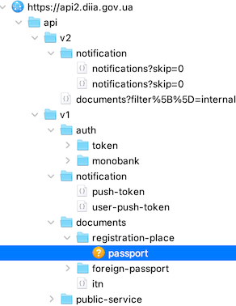

In this post I will describe how one can write a custom Cydia Substrate run-time patch to modify the behavior of an iOS app.

Recently I've read a post by the Ministry of Digital Transformation of Ukraine 🇺🇦 that they are launching a bug bounty program for one of their services - Diia (Дія), a mobile app that allows you to store your various IDs on a smartphone. Immediately I became very interested in the topic. I decided to try to intercept some HTTP requests to see how the communication with the backend is done.

The app uses HTTPS and SSL pinning, so unfortunately, I couldn't provide it with a self-signed certificate, setup a proxy server on my Mac, and expect it to work. I needed to bypass SSL certificate validation, and that could be done on a jailbroken device.

## Jailbreak detection

I installed the app on my jailbroken iPhone and right after the launch screen, I was presented with the next pop-up:


Which basically says "Your devices has been jailbroken, I refuse to continue" and if you tap on "OK" the app simply crashes.

So, there was not much left, I needed to bypass this check to continue with SSL unpinning.

## Debugger

First, find the path to the executable on the device:

```sh
iphone-7p:~ find /var/containers/Bundle/Application/*/ -name *.app | grep Diia

/var/containers/Bundle/Application/3AE10E72-DFDD-48AE-945D-76FD7AB4C8B6/Diia.app
```

Next launch the LLDB:

```sh
iphone-7p:~ debugserver localhost:1111 -x backboard /var/containers/Bundle/Application/3AE10E72-DFDD-48AE-945D-76FD7AB4C8B6/Diia.app/Diia
```

Set a symbolic breakpoint on `+[UIAlertController alertControllerWithTitle:message:preferredStyle:]` as this is an iOS API responsible for this kind of pop-up you can see on the screenshot above.

```
(lldb) b +[UIAlertController alertControllerWithTitle:message:preferredStyle:]
(lldb) c
```

The app will hit a breakpoint shortly  after the launch:

```
Process 2495 resuming
Process 2495 stopped
* thread #1, queue = 'com.apple.main-thread', stop reason = breakpoint 1.1
    frame #0: 0x00000001ac2d3f8c UIKitCore` +[UIAlertController alertControllerWithTitle:message:preferredStyle:]
UIKitCore`+[UIAlertController alertControllerWithTitle:message:preferredStyle:]:
->  0x1ac2d3f8c <+0>:  stp    x26, x25, [sp, #-0x50]!
    0x1ac2d3f90 <+4>:  stp    x24, x23, [sp, #0x10]
    0x1ac2d3f94 <+8>:  stp    x22, x21, [sp, #0x20]
    0x1ac2d3f98 <+12>: stp    x20, x19, [sp, #0x30]
    0x1ac2d3f9c <+16>: stp    x29, x30, [sp, #0x40]
    0x1ac2d3fa0 <+20>: add    x29, sp, #0x40            ; =0x40
    0x1ac2d3fa4 <+24>: mov    x19, x4
    0x1ac2d3fa8 <+28>: mov    x21, x3
Target 0: (Diia) stopped.
```

Let's look into a backtrace:

```
(lldb) bt
* thread #1, queue = 'com.apple.main-thread', stop reason = breakpoint 1.1
  * frame #0: 0x00000001ac2d3f8c UIKitCore` +[UIAlertController alertControllerWithTitle:message:preferredStyle:]
    frame #1: 0x00000001007e3f84 Diia` ___lldb_unnamed_symbol6225$$Diia  + 232
    frame #2: 0x000000010074dd80 Diia` ___lldb_unnamed_symbol2119$$Diia  + 1152
    frame #3: 0x000000010074cd1c Diia` ___lldb_unnamed_symbol2101$$Diia  + 132
    frame #4: 0x00000001acd9cc04 UIKitCore` -[UIApplication _handleDelegateCallbacksWithOptions:isSuspended:restoreState:]  + 356
    frame #5: 0x00000001acd9eba4 UIKitCore` -[UIApplication _callInitializationDelegatesWithActions:forCanvas:payload:fromOriginatingProcess:]  + 5076
...
```

We are only interested in 3 functions inside `Diia` binary called immediately before the call to `UIKitCore`, where our breakpoint was hit.

Let's strat with the first one, get it real address inside the binary:

```
(lldb) im loo -a 0x00000001007e3f84
      Address: Diia[0x00000001000c7f84] (Diia.__TEXT.__text + 789168)
      Summary: Diia`___lldb_unnamed_symbol6225$$Diia + 232
```

Now let's dump the **decrypted** binary from the device and analyze it in disassembler (on how to do it you can learn from the [previous post]({{ site.baseurl }}/0x01/).

## Static and dynamic analysis

When you jump to the address `0x1000c7f84` you can see that it's exactly the code which setups parameters needed for `+[UIAlertController alertControllerWithTitle:message:preferredStyle:]` and calls it using Objective-C runtime's `objc_msgSend`.


If you follow the call graph of the function at `0x1000c7f84`, you will eventually end-up at the function `0x1000c72cc`, which is actually doing the check, let's call it (by artifacts found inside) `general_jailbreak_error`:


Let's follow it and see from where it's being called:


As you can see there are two instructions:

```
00000001000c7ebc         bl         sub_1000c72cc
00000001000c7ec0         tbz        w0, 0x0, loc_1000c80e4
```

Here you can see a call to `general_jailbreak_error` function and following it another `tbz` instruction, whcih basically tests bit and branch if zero to a label. Let's set a breakpoint and debug it.

To get image base address:

```
(lldb) im li Diia
[  0] 35F7E71A-D274-3401-AA5C-CE0EC7B9A39B 0x0000000104898000 /private/var/containers/Bundle/Application/3AE10E72-DFDD-48AE-945D-76FD7AB4C8B6/Diia.app/Diia (0x0000000104898000)
```

Set a breakpoint at `tbz` instruction and continue execution:

```
(lldb) b -a 0x0000000104898000+0xc7ec0
Breakpoint 1: where = Diia`___lldb_unnamed_symbol6225$$Diia + 36, address = 0x000000010495fec0
(lldb) c
Process 2531 resuming
```

Breakpoint got hit:

```
Process 2531 stopped
* thread #1, queue = 'com.apple.main-thread', stop reason = breakpoint 1.1
    frame #0: 0x000000010495fec0 Diia` ___lldb_unnamed_symbol6225$$Diia  + 36
Diia`___lldb_unnamed_symbol6225$$Diia:
->  0x10495fec0 <+36>: tbz    w0, #0x0, 0x1049600e4     ; <+584>
    0x10495fec4 <+40>: adrp   x8, 878
    0x10495fec8 <+44>: ldr    x8, [x8, #0xd78]
    0x10495fecc <+48>: cmn    x8, #0x1                  ; =0x1
    0x10495fed0 <+52>: b.ne   0x104960104               ; <+616>
    0x10495fed4 <+56>: adrp   x8, 930
    0x10495fed8 <+60>: ldr    x20, [x8, #0xf68]
    0x10495fedc <+64>: bl     0x1049c1174               ; ___lldb_unnamed_symbol10190$$Diia
Target 0: (Diia) stopped.
```

Let's inspect `w0` register

```
(lldb) reg r w0
      w0 = 0x00000001
```

Now, change it to `0` and continue:

```
(lldb) reg w w0 0x0
(lldb) c
Process 2531 resuming
```

Our app launches normally! (Redacted screenshot)


## Patch preparation

So I managed to bypass this simple check using a debugger. But I want to be able to launch the app without the debugger attached. There are possible ways to do it, like patching the binary and, for example, replacing that `tbz` check with `nop` - no operation, but this will break with new app update, and the code signature will no longer be valid, so this is not a preferred way. For my use-case, the prefered way is writing run-time patch that will be injected into a binary every time it runs and patch the check for us.

There are several higher-level libs that allow you rebind (hook) symbols in Mach-O executable (format of binaries used by Apple):

- [Cydia Substrate](https://iphonedevwiki.net/index.php/Cydia_Substrate) by [@saurik](https://twitter.com/saurik)
- [fishhook](https://github.com/facebook/fishhook)

Both of them are based on the same principle of how Mach-O dependencies are resolved at run-time. Obviously, both of those libs can only rebind external symbols that our app uses, but unless the app uses some syscalls crafted in inline-assembly - we are good.

By further studying the disassembled code, we can see all the checks that app is really doing inside `general_jailbreak_error` function:


Like testing for a presence of the particular files with `-[NSFileManager fileExistsAtPath:]` or registered URL scheme with `-[UIApplication canOpenURL:]`.

We can use a debugger or tools like `frida` to trace those calls, this will speed up the process. Eventually we will came up with the list of files that looks like this:

```sh
/Applications/Cydia.app
/Applications/blackra1n.app
/Applications/FakeCarrier.app
/Applications/Icy.app
/Applications/IntelliScreen.app
/Applications/MxTube.app
/Applications/RockApp.app
/Applications/SBSettings.app
/Applications/WinterBoard.app
/Library/MobileSubstrate/MobileSubstrate.dylib
/Library/MobileSubstrate/DynamicLibraries/LiveClock.plist
/Library/MobileSubstrate/DynamicLibraries/Veency.plist
/bin/bash
/usr/bin/sshd
/usr/sbin/sshd
/usr/libexec/sftp-server
/etc/apt
/private/var/lib/apt/
/private/var/stash
/private/var/mobile/Library/SBSettings/Themes
/private/var/lib/cydia
/private/var/tmp/cydia.log
/System/Library/LaunchDaemons/com.saurik.Cydia.Startup.plist
/System/Library/LaunchDaemons/com.ikey.bbot.plist
/private/JailbreakTest.txt
```

And a single URL scheme `"cydia://"`.

## The patch

Cydia Substrate, according to the iPhoneDevWiki, consists of 3 major components: MobileHooker, MobileLoader and safe mode. I decided to go with it because of MobileLoader component, which will inject our patch automatically every time we run the app. No need to attach the debugger.

MobileHooker is responsible for an actual higher-level hooking API with functions like `MSHookFunction` and `MSHookMessageEx`. You can find official API [here](http://www.cydiasubstrate.com/api/c/).

To write the patch, first, we need to download the latest Cydia Substrate release, which we can link our code against. You can find the latest release at [apt.bingner.com](https://apt.bingner.com/debs/) repo. Here is a direct link to the latest version of [mobilesubstrate](https://apt.bingner.com/debs/1443.00/mobilesubstrate_0.9.7111_iphoneos-arm.deb) deb package yet - `0.9.7111`.

Extract it somewhere on your Mac:

```sh
mbp:~ dpkg -x mobilesubstrate_0.9.7111_iphoneos-arm.deb mobilesubstrate/
```

Inside, you can find two files we are interested in:

- `/usr/include/substrate.h` - header where all the API is defined
- `/usr/lib/libsubstrate.dylib` - the hooking lib itself, which we will link against

## Xcode project

Create a new Xcode `Dynamic Library` plain C\C++ project.

Configure following `Build Settings`:

- `Base SDK` = `iphoneos`
- `Header Search Path` = `$(SRCROOT)/mobilesubstrate/usr/include`
- `Library Search Path` = `$(SRCROOT)/mobilesubstrate/usr/lib`
- `Other Linker Flags` = `-lsubstrate`

The path `$(SRCROOT)/mobilesubstrate` - depends on where you extracted the deb package, I've put mine alongside `.xcodeproj` file.

Create new `main.m` file for the patch itself. Here is the full listing of mine:

```objc
#import <Foundation/Foundation.h>
#import <UIKit/UIKit.h>

#include <substrate.h>

// MARK: - NSFileManager

static NSArray *files;

BOOL (*old_fileExistsAtPath)(id self, SEL _cmd, NSString *path);
BOOL new_fileExistsAtPath(id self, SEL _cmd, NSString *path) {
    if ([files containsObject:path]) {
        return NO;
    }
    return old_fileExistsAtPath(self, _cmd, path);
}

// MARK: - UIApplication

static NSArray *schemes;

BOOL (*old_canOpenURL)(id self, SEL _cmd, NSURL *URL);
BOOL new_canOpenURL(id self, SEL _cmd, NSURL *URL) {
    for (NSString *scheme in schemes) {
        if ([[URL absoluteString] hasPrefix:scheme]) {
            return NO;
        }
    }
    return old_canOpenURL(self, _cmd, URL);
}

// MARK: - Init

__attribute__((constructor)) void lib_init() {
    printf("[+] diiabypass init.\n");
    files = @[
        @"/Applications/Cydia.app",
        @"/Applications/blackra1n.app",
        @"/Applications/FakeCarrier.app",
        @"/Applications/Icy.app",
        @"/Applications/IntelliScreen.app",
        @"/Applications/MxTube.app",
        @"/Applications/RockApp.app",
        @"/Applications/SBSettings.app",
        @"/Applications/WinterBoard.app",
        @"/Library/MobileSubstrate/MobileSubstrate.dylib",
        @"/Library/MobileSubstrate/DynamicLibraries/LiveClock.plist",
        @"/Library/MobileSubstrate/DynamicLibraries/Veency.plist",
        @"/bin/bash",
        @"/usr/bin/sshd",
        @"/usr/sbin/sshd",
        @"/usr/libexec/sftp-server",
        @"/etc/apt",
        @"/private/var/lib/apt/",
        @"/private/var/stash",
        @"/private/var/mobile/Library/SBSettings/Themes",
        @"/private/var/lib/cydia",
        @"/private/var/tmp/cydia.log",
        @"/System/Library/LaunchDaemons/com.saurik.Cydia.Startup.plist",
        @"/System/Library/LaunchDaemons/com.ikey.bbot.plist",
        @"/private/JailbreakTest.txt"
    ];
    printf("[+] hook -[NSFileManager fileExistsAtPath:]\n");
    MSHookMessageEx([NSFileManager class], @selector(fileExistsAtPath:), (void *)&new_fileExistsAtPath, (void *)&old_fileExistsAtPath);
    
    schemes = @[
        @"cydia://"
    ];
    printf("[+] hook -[UIApplication canOpenURL:]\n");
    MSHookMessageEx([UIApplication class], @selector(canOpenURL:), (void *)&new_canOpenURL, (void *)&old_canOpenURL);
}
```

It simply hooks two methods `-[NSFileManager fileExistsAtPath:]` and `-[UIApplication canOpenURL:]`, checks the arguments, and returns `NO` if the arguments match anything form the "stop" list. That's all.

Compile it for `Any iOS Device (arm64)`, let Xcode sign it automatically (or re-sign if needed) for us, and copy to the device into `/Library/MobileSubstrate/DynamicLibraries/` where MobileLoader can pick it up.

One more thing left is to create a filter for the MobileLoader to know where to inject our patch, into what binary.

Create `plist` file, also inside `/Library/MobileSubstrate/DynamicLibraries/`, with the name matching our dylib - `libdiiabypass.plist` and following content:

```plist
{ Filter = { Executables = ( Diia ); }; }
```

And that's all, *it just works &copy;*, now the app launches without any problem and without the debugger.


And to disable SSL pinnig, I used [ssl-kill-switch2](https://github.com/nabla-c0d3/ssl-kill-switch2) tweak by [@nabla_c0d3](https://twitter.com/nabla_c0d3), and successfully intercepted requests that I was interested in. This one tweak is enough to disable SSL pinning only if the app uses a default iOS networking stack, which our app does.



---

Thanks for reading, ping me on Twitter [@danylo_kos](https://twitter.com/danylo_kos) if you have any questions.
